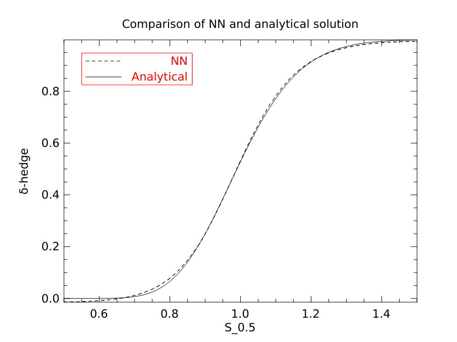

# Deep hedging in OCaml / Owl

Deep hedging in the spirit of H. Buehler, L. Gonon, J. Teichmann & B. Wood (2019) Deep hedging, Quantitative Finance, 19:8, 1271-1291, implemented in [Owl](https://ocaml.xyz).

Run with `dune exec src/main.exe`.

